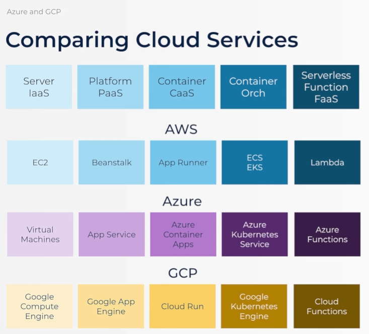

# Project Twin Architecture:

# React - JS/ TS frontend framework

1. **Component-based**: Reusable components (Building blocks with markup, styles logic)

2. **Declarative**: Describe UI gien state (React efficiently updates the DOM with any changes)

3. **Props & State**: Get props, manage state (When either change, React re-renders the component and components it contains)

4. **JSX/TSX**: Convenient format (Belnds HTML and JS/TS in a simple, easy-to-read way to increase productivity)

5. **Ecosystem**: Incredibly Rich (Forms, Routing, UI component libraries like Material UI, Chakra UI)

# NextJS (*built by Vercel*):

- This is the framework built on top of React
- Includes 2 approaches for Routing requests for pages:
    - Pages router (pages/) is simpler, trusted, very common.
    - App Router (app/) is newer, more powerful.
- Pages can be rendered client-side or server-side.
- Includes built-in tooling to transpile & bundle.

# Python Backend Frameworks:

- **Django**: Heavyweight, "batteries included" framework ORM, authentication, templating, admin interface.

- **Flask**: Micro-framework - routing and request handling, Lightweight and quick to start, but requires add-ons.

- **FastAPI**: Modern, async, built on Starlette and Pydantic, Optimized for APIs

# Compare Cloud Services

# AWS 

## Cloud Deployment Archetypes

- **Traditional Cloud Servers - IaaS**: Where everything started; rent a server and install everything Eg: EC2 (AWS), Terraform

- **Platform as a Service - PaaS**: Just bring you code; the deployment is handled for you. Eg: Vercel Beanstalk

- **Container as a Service - Caas**: You provide an app in a container; the service takes care of the rest. Eg: App Runner (AWS)

- **Container Orchestration**: Run your own fleet of containers and manage how they scale. Eg: ECS, EKS (AWS)

- **Serverless Functions - FaaS**: Upload individual tiny functions and pay per request. Eg: Lambda

## AWS BIOLOGY

### Components

- **IAM**: Identity Access Management

    - Granular security is one of AWS's strengths (Super tiresome and painful, but for good reason)

    - We will start by creating a Root User (Only used for assigning permission & budgeting)

    - Then we will create our "IAM User" (Called aiengineer - we will be our workhorse for the course)

    - As per the policy adding or permission to access various components or resources in AWS.
        - From Root User, we can **add or create custom policies**, which will be tagged to the User Group policy for a certain IAM user.

- **Amazon S3: Simple Storage Service**: Like a shared drive in the cloud, organized in "buckets", this is where the build file is uploaded, and memory management for api to handle history.

- **Aws Lambda**: Individual functions on the cloud, to add the backend code to run, pay for CPU time.(It's like Azure function apps.)

- **Amazon CloudFront**: A content delivery network (CDN) for quickly serving static content. (hosting domain name or web url to public with permissions.)

- **Amazon API Gateway**: Create , manage and scale APIs and handle their routes.

- **Amazon Bedrock**: Quickly build Gen AI applications by connecting to LLMs via API.

- **AWS Resource Explorer**: Used to check the overall resource allocation or services used for a website or project.

- **App runner**: Deploy containers (Simplest AWS way to deploy containerized web applications using docker)

- **ECR Elastic Container Registry**: Registry (Like github but for container on AWS)

- **CloudWatch**: Monitoring (Collects logs from all your AWS services)

- **Amazon SageMaker** (*It's like huggingFace*)

    - **End-end ML development**: Build , train, fine-tune, deploy and manage your own models.

    - **Model training + hosting**: Managed infrastructure for running training jobs and deploying trained models as scalable, production ready end-points.

    - **Designed for MLOps**: Includes experiment tracking, model versioning, automated model tuning, and monitoring tools to make production ML repeatable and reliable.

- **Difference between Bedrock and SageMaker**:

    

- **AWS Databases**
    - **RDS**: *Relational Databse Service*: the umbrella managed service for relational databses, supporting different engines (MySQL, PostgreSQL).
    - **Aurora**: one of the Dataase Engines offered in RDS; use RDS to create the database cluster, select Aurora as the engine. Designed by AWS to be fast and scalable.
    - **Aurora Serverless V2**: Automatically adjusts databse capacity responding qucikly to changes in workload without downtime for pay-as-you-go scaling.
    - **Dynamo**: is the NoSQL offering.
    - **DocumentDB**: It is like a mongoDB style database.

# MLOps

**MLOps is Devops for ML: Manage the entire ML lifecycle.**

1. Track datasets, model versions, and training configurations so you can reproduce and roll back if needed.

2. Monitoring & model drift - Deployed models can degrade over time as real-world data changes ("model drift"); MLOps involves monitoring predictions and retraining when accuracy drops.

3. SageMaker covers MLOps features: experiment tracking, model registry, endpoints with monitoring, and automation tools for retraining when drift is detected.

# Terraform

- **Controlled: Checked into Git**: .tf files with your configuration (Not checked in state files that map configuration to resources).

- **Automated: Configures Everything**: No more AWS, Google Cloud, Azure  console! Everything will be automated (except IAM).

- **Repeatable: Destroy & Recreate**: terraform init - stands up your entire environment terraform destroy -deletes.

- **AWS CDK** is Amazon's proprietary version.
- **GCP CDK** is Google CLoud proprietary version.
- **AZURE CDK** is Azure proprietary version.

## Terminology

- **Provider**: A vendor like AWS (A plugin to make Terraform apply to that provider).

- **Variable**: Parameters (Configurable settings that affect your deployment).

- **Resource**: The building block (Each AWS service to be created is described with a resource).

- **State**: Record of resources (Maps the configuration to actual resources).

- **Output**: Results of deployment (Like actual CloudFront distribution URLs).

- **Workspaces**: Separated State (Isolated state for the same configuration).

# Docker

- A box within your box (A lightweight alternative to VMs that shares the host's OS)
- Isolated, portable (Run the same software everywhere)

- **DockerFile**: Recipe (A text file with instructions for installing & configuring)
- **Image**: Snapshot (Created by building a Dockerfile and ready to be made live)
- **Container**: A live instance (A running isolated environment created from an image)

# Github Actions

- **Actions**: Platform (Run scripts in response to actions like doing a git push).
- **Workflows**: Orchestration (YAML files stored in github/workflows).
- **Jobs**: Execution (Collection of steps that run on a 'Runner' VM). 

