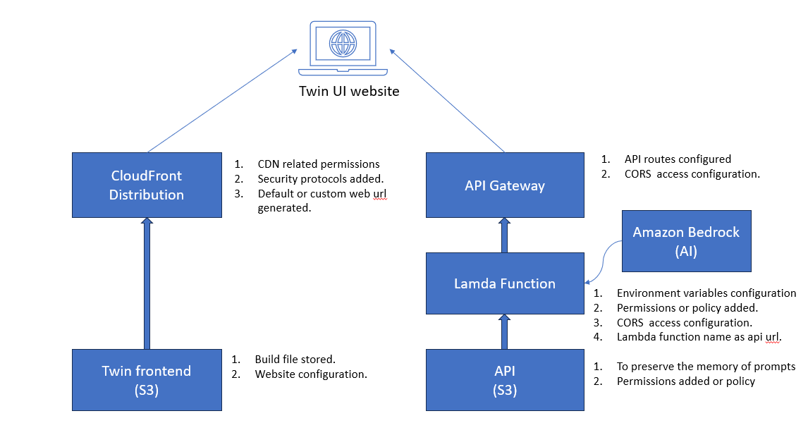
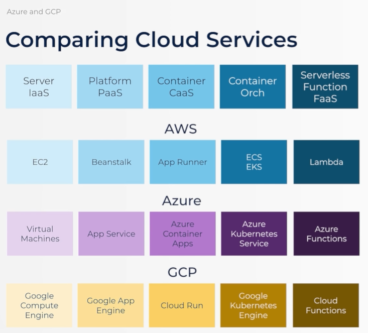
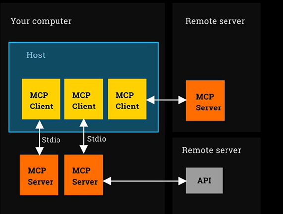

# Policy Frameworks of Agentic AI:
A policy framework is indeed a set of guidelines that control and direct actions in alignment with specific values and norms.

- Policy frameworks guide AI agents to make decisions that are consistent, predictable, and    ethical, aligning with values set by designers or users.

- There are two main types: decision-making frameworks, which include ethical policies and human oversight mechanisms, and rules-based frameworks, which enforce specific predefined rules for agent behavior.
- Continuous monitoring is essential to ensure AI agents comply with these policies and adapt appropriately without violating ethical or legal standards.

- Utility frameworks maximize a system's usefulness.
  - The **utility function** maps outcomes to numerical values, calculating their desirability, which helps the system choose the best actions.
  For example,  A Security camera scanning a person carrying an object, where the ai must rank the object based on the danger of the object.

- Utility functions will be integrated with tools like below,
  - Preference Modeling is setting user preferences and integrating them into the utility function.
  - Probabilistic Modeling determines the amount of risk and integrating the risks into the utility function
  - Trade Off Analysis works with risk analysis to maximize utility (*Balancing risk and utility involves trade-off analysis to find optimal solutions that align with the systems goals.*)

- Reinforcement Algorithms are integral part of the agentic ai, it learns by using rewards and metrics to a desirable outcome.
  - Q learning is one such algorithm it uses a table Q-Table to keep track of the best actions to take, gradually learning the optical actions to maximize a reward.
  *Reward are numerical values the agent receives after taking an action in a specific state*

  - Developing Q learning: 
    1. Define the environment
    2. Identify states.
    3. Define actions (i.e choices) that agents can make
    4. Establish reward signals
    5. Develop policy
    6. Define a value function (*Estimates the expected cumulative reward of being in a particular state and following a certain policy*)

# Architecture:

- **Major vs. Minor Architectures:** Major architectures handle strategic tasks and overall control, while minor architectures manage specific smaller tasks within the system.

- Seven Major Architectures: These include 
  1. single-agent *(one agent solving a problem)*
  2. multi-agent *(collaborative agents)*, 
  3. reflection-based *(agents self-evaluate and refine)*, 
  4. tool integrated *(agents use external tools)*, 
  5. planning centric *(agents break down complex tasks into steps)*, 
  6. generative AI networks *(agents collaborate to leverage specialized skills)*
  7. human-AI collaboration *(agents automate routine tasks to support human creativity)*.

- **Architecture Impact:** The architecture shapes how AI agents process information, learn, and   make decisions, which is crucial for building effective autonomous systems.

- Types of minor based architecture: 
  1. **Behavior based:** It is a reactive based architecture because it emphasizes on specific behavior or model patterns that are less applicable across the domain.
  2. **Emotional based:**  It is a humanized ai agents, that respond like a emotion to a certain problem.
  3. **Swarm Intelligence:** It is a collective based or community-based architecture of agents, that are used to leverage specific behavior something like ant colony.

  *At the end of the day, the minor architecture is a custom designed architecture which is used to tackle a specific task.*

# Developing a Multi Agent Co operative system: 

  - **Determine communication protocols** *It is protocols or ontologies that all agents must follow to communicate which ensures robust and secure system*
  - **Define shared goals and rewards** *For eg.. Maximizing sales thorough less costs when agents collaborate together they can get the work done effectively*
  - **Setup Co-ordination mechanisms** *Helps in organizing the efforts to avoid conflicts,redundant actions*
  - **Establish de-centralized decision making** *This is critical , where the agents must be capable of taking independent decisions which maximizes efficiency and reduce redundancy*
  - **Define role specialization** *Assigning specific abilities to different agents based on their capabilities, doing this maximizes efficiency and reduce redundancy*

# Project Twin Architecture:

# React - JS/ TS frontend framework

1. **Component-based**: Reusable components (Building blocks with markup, styles logic)

2. **Declarative**: Describe UI gien state (React efficiently updates the DOM with any changes)

3. **Props & State**: Get props, manage state (When either change, React re-renders the component and components it contains)

4. **JSX/TSX**: Convenient format (Belnds HTML and JS/TS in a simple, easy-to-read way to increase productivity)

5. **Ecosystem**: Incredibly Rich (Forms, Routing, UI component libraries like Material UI, Chakra UI)

# NextJS (_built by Vercel_):

- This is the framework built on top of React
- Includes 2 approaches for Routing requests for pages:
  - Pages router (pages/) is simpler, trusted, very common.
  - App Router (app/) is newer, more powerful.
- Pages can be rendered client-side or server-side.
- Includes built-in tooling to transpile & bundle.

# Python Backend Frameworks:

- **Django**: Heavyweight, "batteries included" framework ORM, authentication, templating, admin interface.

- **Flask**: Micro-framework - routing and request handling, Lightweight and quick to start, but requires add-ons.

- **FastAPI**: Modern, async, built on Starlette and Pydantic, Optimized for APIs

# Compare Cloud Services

# AWS

## Cloud Deployment Archetypes

- **Traditional Cloud Servers - IaaS**: Where everything started; rent a server and install everything Eg: EC2 (AWS), Terraform

- **Platform as a Service - PaaS**: Just bring you code; the deployment is handled for you. Eg: Vercel Beanstalk

- **Container as a Service - Caas**: You provide an app in a container; the service takes care of the rest. Eg: App Runner (AWS)

- **Container Orchestration**: Run your own fleet of containers and manage how they scale. Eg: ECS, EKS (AWS)

- **Serverless Functions - FaaS**: Upload individual tiny functions and pay per request. Eg: Lambda

## AWS BIOLOGY

### Components

- **IAM**: Identity Access Management
  - Granular security is one of AWS's strengths (Super tiresome and painful, but for good reason)

  - We will start by creating a Root User (Only used for assigning permission & budgeting)

  - Then we will create our "IAM User" (Called aiengineer - we will be our workhorse for the course)

  - As per the policy adding or permission to access various components or resources in AWS.
    - From Root User, we can **add or create custom policies**, which will be tagged to the User Group policy for a certain IAM user.

- **Amazon S3: Simple Storage Service**: Like a shared drive in the cloud, organized in "buckets", this is where the build file is uploaded, and memory management for api to handle history.

- **Aws Lambda**: Individual functions on the cloud, to add the backend code to run, pay for CPU time.(It's like Azure function apps.)

- **Amazon CloudFront**: A content delivery network (CDN) for quickly serving static content. (hosting domain name or web url to public with permissions.)

- **Amazon API Gateway**: Create , manage and scale APIs and handle their routes.

- **Amazon Bedrock**: Quickly build Gen AI applications by connecting to LLMs via API.

- **AWS Resource Explorer**: Used to check the overall resource allocation or services used for a website or project.

- **App runner**: Deploy containers (Simplest AWS way to deploy containerized web applications using docker)

- **ECR Elastic Container Registry**: Registry (Like github but for container on AWS)

- **CloudWatch**: Monitoring (Collects logs from all your AWS services)

- **Amazon SageMaker** (_It's like huggingFace_)
  - **End-end ML development**: Build , train, fine-tune, deploy and manage your own models.

  - **Model training + hosting**: Managed infrastructure for running training jobs and deploying trained models as scalable, production ready end-points.

  - **Designed for MLOps**: Includes experiment tracking, model versioning, automated model tuning, and monitoring tools to make production ML repeatable and reliable.

- **Difference between Bedrock and SageMaker**:

  

- **AWS Databases**
  - **RDS**: _Relational Databse Service_: the umbrella managed service for relational databses, supporting different engines (MySQL, PostgreSQL).
  - **Aurora**: one of the Dataase Engines offered in RDS; use RDS to create the database cluster, select Aurora as the engine. Designed by AWS to be fast and scalable.
  - **Aurora Serverless V2**: Automatically adjusts databse capacity responding qucikly to changes in workload without downtime for pay-as-you-go scaling.
  - **Dynamo**: is the NoSQL offering.
  - **DocumentDB**: It is like a mongoDB style database.

# MLOps

**MLOps is Devops for ML: Manage the entire ML lifecycle.**

1. Track datasets, model versions, and training configurations so you can reproduce and roll back if needed.

2. Monitoring & model drift - Deployed models can degrade over time as real-world data changes ("model drift"); MLOps involves monitoring predictions and retraining when accuracy drops.

3. SageMaker covers MLOps features: experiment tracking, model registry, endpoints with monitoring, and automation tools for retraining when drift is detected.

# Terraform

- **Controlled: Checked into Git**: .tf files with your configuration (Not checked in state files that map configuration to resources).

- **Automated: Configures Everything**: No more AWS, Google Cloud, Azure console! Everything will be automated (except IAM).

- **Repeatable: Destroy & Recreate**: terraform init - stands up your entire environment terraform destroy -deletes.

- **AWS CDK** is Amazon's proprietary version.
- **GCP CDK** is Google CLoud proprietary version.
- **AZURE CDK** is Azure proprietary version.

## Terminology

- **Provider**: A vendor like AWS (A plugin to make Terraform apply to that provider).

- **Variable**: Parameters (Configurable settings that affect your deployment).

- **Resource**: The building block (Each AWS service to be created is described with a resource).

- **State**: Record of resources (Maps the configuration to actual resources).

- **Output**: Results of deployment (Like actual CloudFront distribution URLs).

- **Workspaces**: Separated State (Isolated state for the same configuration).

# Docker

- A box within your box (A lightweight alternative to VMs that shares the host's OS)
- Isolated, portable (Run the same software everywhere)

- **DockerFile**: Recipe (A text file with instructions for installing & configuring)
- **Image**: Snapshot (Created by building a Dockerfile and ready to be made live)
- **Container**: A live instance (A running isolated environment created from an image)

# Github Actions

- **Actions**: Platform (Run scripts in response to actions like doing a git push).
- **Workflows**: Orchestration (YAML files stored in github/workflows).
- **Jobs**: Execution (Collection of steps that run on a 'Runner' VM).

# RAG (Real-time Augmented Generation):

RAG is a technique used to improve the accuracy of the response given by the LLM for a particular prompt or query.
The accuracy improved by using Embeddings and vectorization of the content.
The main framework would be LangChain which has the modules to convert chunks into vectors using **OpenAIEmbeddings** function or any other which are available, and then can be
stored into either **VectorDB** (which is free), **Chroma DB** (requires server), which those vector chunks can be viewed in 2D/3D graphs using **t-SNE**, these are like knowledge bases similar to traditional SQL DB or mongo db.
## Two Phases of RAG: 

## 10 RAG Advanced Techniques: 

1. **Chunking R&D**: experiment with chunking strategy. (Eg: Semantic Chunking)
2. **Encoder R&D**: select the best Encoder model based on a test set.
3. **Improve Prompts**: general content, the current date, relevant context and history.
4. **Document pre-processing**: use an LLM to make the chunks and/or test for encoding.
5. **Query rewriting**: use an LLM to convert the user's question to a RAG query.
6. **Query expansion**: use an LLM to turn the question into multiple RAG queries.
7. **Re-ranking**: use an LLM to sub-select from RAG results.
8. **Hierarchical**: use an LLM to summarize at multiple levels.
9. **Graph RAG**: retrieve content closely related to similar documents.
10. **Agentic RAG**: use Agents for retrieval, combining with Memory and Tools such as SQL.

## Evaluation Metrics:

- Curate a Test Set - Example questions set with the right context identified and reference answers provided.

### Measure Retrieval

- **MRR (Mean Reciprocal Rank)**: Average inverse rank of first hit; 1 if the first chunk always has relevent context.
- **nDCG (Normalized Discounted Cumulative Gain)**: Did relevent chunks get ranked higher up.
- **Recall@K**: Proportion of tests where relevent context was in the top K chunks Or if you have multiple keywords to look for, keyword converage is similar recall metric
- **Precision@K**: Proportion of the top K chunks that are relevent.

### Measure Answers

- Use LLM-as-a-judge to score provided answers against criteria like accuracy, completeness and relevance.

# MCP:

It makes it frictionless to integrate, It's taking off! Exploding ecosystem

- **What it's not**:
  - A framework for building agents
  - A fundamental change to how agents work
  - A way to code agents
- **What it is**
  - A protocol - a standard
  - A simple way to integrate tools, resources, prompts
  - A USB-C port for AI Applications

## The three Components:

1. **Host** is an LLM app like Claude or our Agent architecture.
2. **MCP Client** lives inside Host and connects 1:1 to MCP Server.
3. **MCP Server** provides tools, context and prompts.

Example:

- Claude Desktop can be used to run an MCP Client.
- Fetch is an MCP Server that searches the web via a headless browser.
- FileSystem is an MCP Server that helps connect any folder in the system.

